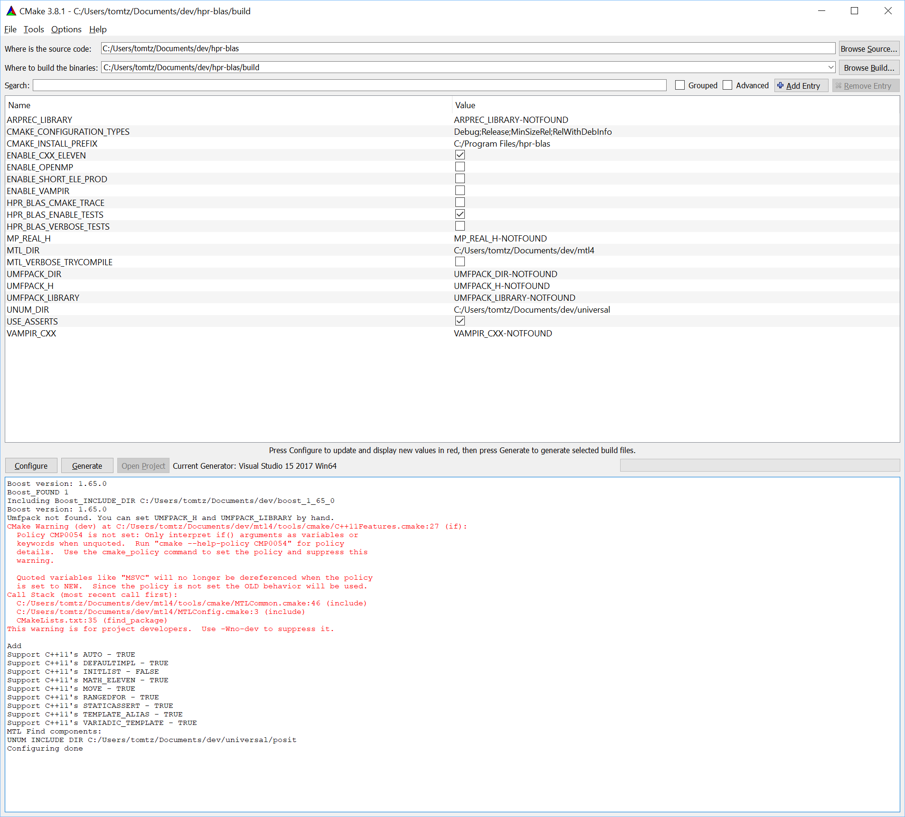

# HPR-BLAS (pronounced hyper-blas)
Hyper-BLAS: High-Performance Reproducible BLAS using posit arithmetic and user controlled rounding

# Introduction

Round-off makes floating point addition nonassociative, and different orders of summation often produce different results.
On a parallel machine, the order of summation will vary from run to run, or even subroutine-call to subroutine-call, depending on scheduling of available resources, so results will different from run to run.
HPR-BLAS offers high-performance reproducible BLAS independent of concurrency levels of the underlying hardware.

The obvious benefit for reproducibility is that debugging in real-time, multi-core systems is now feasible. 
The lack of IEEE Floating Point associativity has made certain bugs elusive in real-time, multi-core systems. 
HPR-BLAS is associative, so any roundoff-related errors caused by spurious events can be debugged productively.

HPR-BLAS enables new applications in very demanding environments. For example, in fracture mechanics,
a shutgun approach is used to generate many random simulations looking for rare events. When one occurs,
an accurate resimulation is started while computing additional information. Reproducibility is essential
to yield correct results.

HPR-BLAS is using posit arithmetic. Posit arithmetic is a tapered floating point system with perfect symmetry around 0 and +-infinity. 
Posits allow custom tailoring of accuracy and dynamic range to the demands of the application. 
This is particularly important for Deep Learning applications where each layer in the network has unique requirements for accuracy and dynamic range. 
Furthermore, posits have a higher informational density than IEEE floats providing additional savings on memory and communication bandwidth and storage.

# How to build

The HPR-BLAS library is a pure template library so no library build step is required. However, HPR-BLAS has two dependencies
1. [Boost](http://www.boost.org)
    Boost provides free peer-reviewed portable C++ source libraries that work well with the C++ Standard Library.
2. [MTL](http://simunova.com)
    Matrix Template Library, a high-performance, high-productivity, scalable, parallel linear algebra library for multi-core, multi-GPU, multi-KPU, and distributed memory machines.
3. [Universal](https://github.com/stillwater-sc/universal)
    Universal Library contains different universal number representations and implementations. HPR-BLAS uses the posit/valid number systems.

To build the programs in the HPR-BLAS library, we are using CMake, so please install the latest version of [CMake](https://cmake.org/download).

Install [Boost](http://www.boost.org). Typically just a download of a compressed file that you decompress, and point to with an environment variable BOOST_ROOT. More details can be found on the BOOST web site.

Clone the [MTL library](http://simunova.com). 
```
git clone https://github.com/simunova/mtl4
```

Next step is to clone the Universal library:
```
git clone https://github.com/stillwater-sc/universal
```

Either set environment variables MTL_DIR and UNUM_DIR to point to the root directories where you installed MTL and the Universal library, or use the CMake tool and set these variables in the CMake user interface. MTL has many options to integrate other high-performance linear algebra libraries and tracing options, but the defaults are sufficient to get started.

Below shows a successful cmake configuration.




